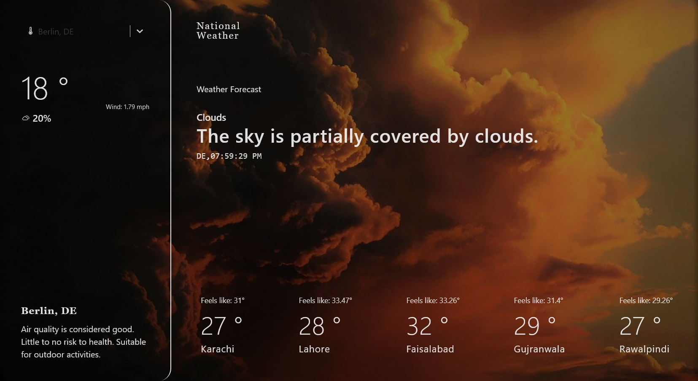

# Awesome Weather App 🌦️

Welcome to the Awesome Weather App! This app provides you with real-time weather information, built using React, Vite, and Tailwind CSS. Stay informed about the weather conditions in your area and around the world with this sleek and user-friendly application.

    <h2> Screenshot </h2>
    

## Features

- **Real-time Weather:** Get up-to-date weather information including temperature, conditions, humidity, and more.
- **Search Functionality:** Search for weather forecasts in different locations. Also you can see the time at that place.
- **Responsive Design:** Enjoy a seamless experience on various devices, from mobile phones to desktops.
- **User-Friendly Interface:** Intuitive and visually pleasing interface for effortless navigation.

## Getting Started

Want to use the Weather App. Either clone this repo and run on your machine or visit the link https://ahmohil.github.io/Weather-App/

